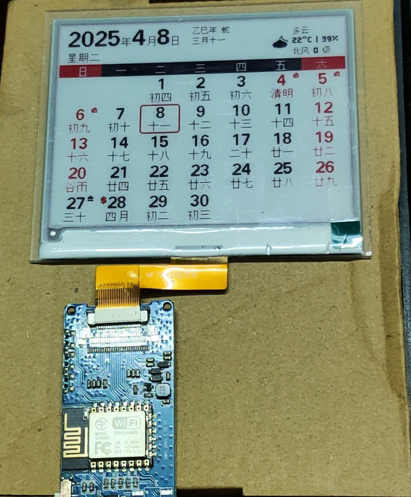

# J-Calendar（ESP8266版本）
原作：[JADE-Jerry/jcalendar](https://github.com/JADE-Jerry/jcalendar)  
完全~~照搬~~（划掉）沿用了原版的排版设计，做了一些优化以适配ESP8266  

# 相比原作的主要变动点
* 修改源码文件结构，精简文件数量，简化调用和传参
* 配网菜单改为单层，同时配置AP和天气KEY等信息
* 由于ESP8266深度睡眠时间有上限（约3.7小时），天气类型固定为实时天气
* 取消了LED和按键
# 关于ESP8266
* 闪存至少为2MiB
* 需要短接16<->RSTB（深度睡眠唤醒复位）
# 关于墨水屏
## 型号
* release固件：WF0420T80CZ15（主控UC8176、排线印字WFT042CZ15）
* 其他请自行修改编译
## 接线
* Busy->4
* RST->2
* DC->0
* CS->15
* SDI->13
* SCK->14
# 用到的网络服务
* [和风天气](https://www.qweather.com/)（需要自行注册获取APP KEY）
* [提莫的神秘小站](https://timor.tech/) 免费节假日API
------
其他未尽事项请参考原作主页
